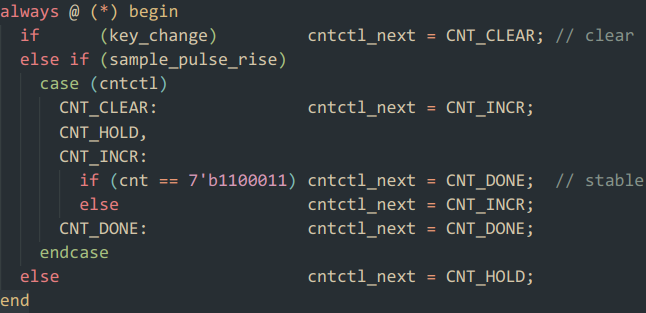
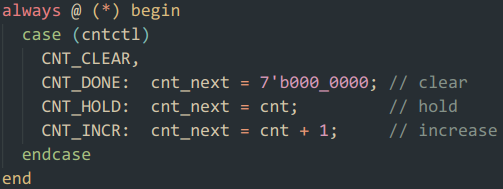
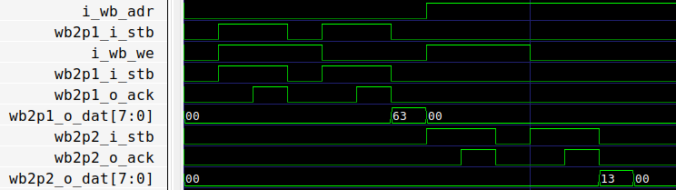
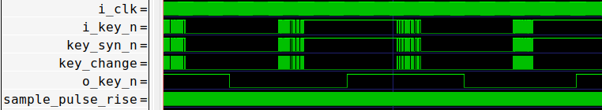

# debounce

## 1 synchronize

- 输入 `i_key_n` 经过两级 FF 同步得到 `key_syn_n` 。

## 2 0.2ms pulse

- 根据地址将 `i_stb` 分配到不同的 `wb2pulse` 模块。
- 根据地址选择各个模块的 `o_ack` `o_dat` 输出。
- 级连两个 `wb2pulse` 模块的 `i_e` 计数使能引脚，并配置适当的 `D` 重载计数次数，得到 `wb2p2_o_pulse` 脉冲信号。
- 通过一级 FF 得到 `wb2p2_o_pulse` 的上升判断信号 `sample_pulse_rise` ，用于采样。

## 3 sample FSM

- control FSM 控制计数器

- 计数器

## 仿真验证

- 配置两个 `wb2pulse` 模块

- 消抖效果

