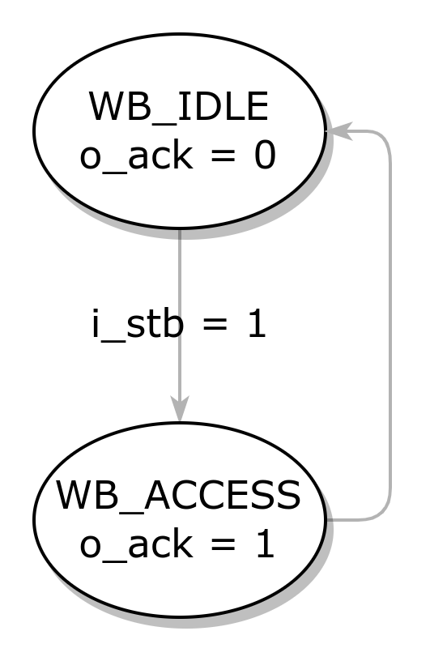
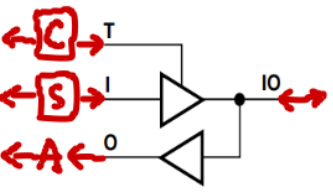
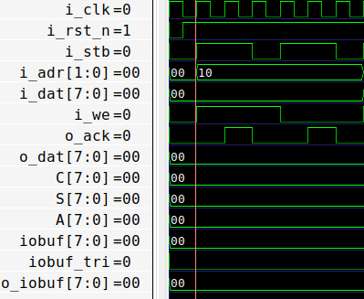
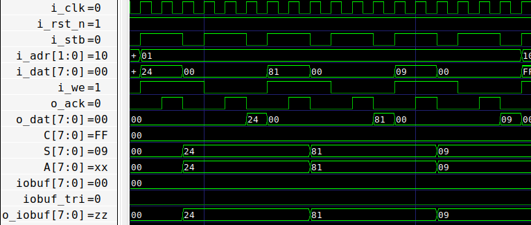
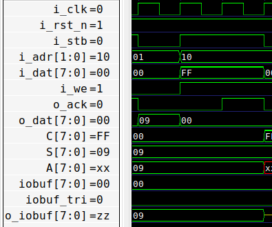
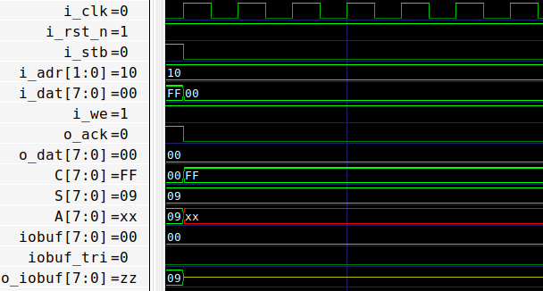
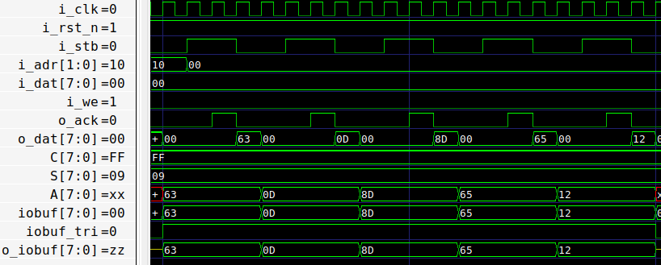
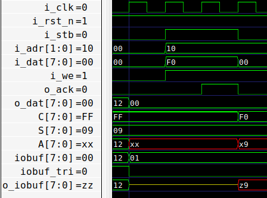
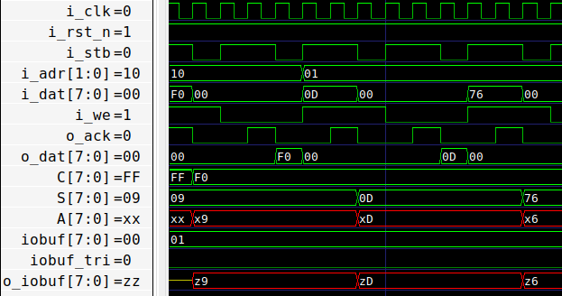

# wb2byteio

## 1 wishbone FSM

- **状态转换**：

- **输出**：
  - 通过状态编码 `wb_state` 输出 `o_ack` 。
  - 在有效时钟沿（延迟一拍），根据 `wb_state` 和 `i_adr` 进行：
    - `A` 的读取。（获取来自 `IO` 的输入）
    - `C` 的写入、读出。（配置 `IOBUF` 的方向）
    - `S` 的写入/读出。（驱动 `I` 输出）

## 2 IOBUF

- 通过 `generate` 例化 8 个 `IOBUF` ，与  `A` `C` `S` 等相连。

## 仿真验证

- 配置 `C` 为全输出

- 写入 `S` ，驱动至输出 `o_iobuf` 

- 配置 `C` 为全输入

- `I` 无驱动，`o_iobuf` 为高阻态

- 驱动 `I` ，`o_iobuf` 有效

- 配置 `C` 为高 4 位输入，低 4 位输出

- 高 4 位无驱动，低 4 位由 `S` 驱动

