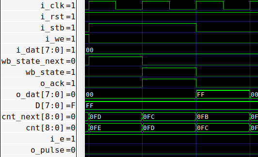

# wb2pulse

`wb2pulse` 模块主要由两个状态机组成：

- **wishbone FSM** 
  
  - **状态**：`wb_state` `wb_state_next` 
  - **状态转换**：
  
  
  
  - **输出**：
    - 通过状态编码 `wb_state` 输出 `o_ack` 。
    - 在有效时钟沿（延迟一拍），根据 `wb_state` 和输入进行 `D` 的写入和读出。
  
- **counter FSM** 
  - **状态**：`cnt[DSIZE:0]` `cnt_next[DSIZE:0]` （增加 1 位用作状态编码输出）
  - **状态转换**：
    - 写入：装载 `{1'b0, i_dat}` 。
    - `i_e` 有效：减计数。
    - 计数快要结束 `CNT_PREPULSE = 9'b0_0000_0001` ：次态为 `CNT_PULSE = 9'b1_0000_0000` 。
    - 计数结束 `9'b1_0000_0000` ：装载 `{1'b0, D}` 。
    - 其他：保持。
  - **输出**：
    - 通过状态编码 `cnt[DSIZE]` 输出 `o_pulse` 。

## 仿真验证

- 写

- 读

- 连续读写

- 计时

