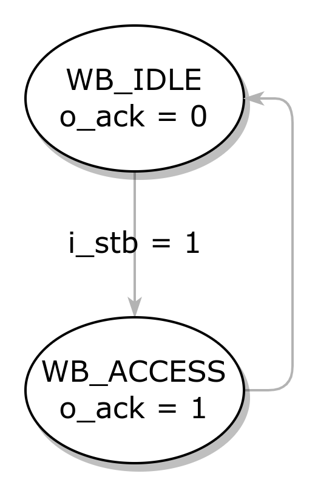

# wb2sram32

## 1 wishbone FSM

- **状态转换**：

- **输出**：
  - 通过状态编码 `wb_state` 输出 `o_ack` 。
- **读写 sram**：
  - 当 `o_ack` 有效并且相应的 `i_sel` 有效，使能读写 `ena` ，这表示将在下一个时钟沿写入/读出。
  - sram 支持每个周期都读写，但是通过 wishbone 总线则是两个周期后才能完成读写。

## 2 SRAM

- 例化 4 个 16kx8 的 sram ，将地址接入每一个实例 sram ，而将 4 个 sram 的 8 bit 存储单元拼接为 32 位，则得到了 16kx32 的 sram 。

## 仿真验证

- 典型读写时序

- `i_sel` 全有效的情况下，向最小 `14'h0000` 地址写入 `32'hABCDABCD` ，向最大 `14'h3fff` 地址写入 `32'hDBCADBCA` ，向 `14'h1262` 地址写入 `32'hFFFF` 。

- 读取各个地址的数据，可见与之前写入的数据相同。

- 以 byte enable 的模式写入数据，向最小 `14'h0000` 地址的低 1 字节写入 `FF` ，向最大 `14'h3fff` 地址的低 2 字节写入 `FFFF` ，向 `14'h1262` 地址的低 3 字节写入 `000000` 。

- 读取相应地址的数据，可以看出 byte enable 功能正确。

